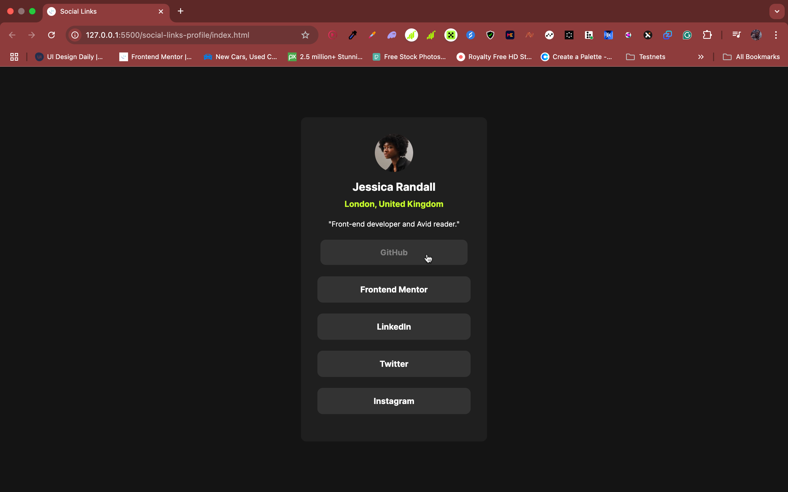

# Social Links Profile

A simple and clean social links profile page built with **HTML** and **CSS**.  
This project is perfect for showcasing your social media profiles in one place.

## 📸 Screenshot

 
*(You can add a real screenshot of your project here!)*

## 🚀 Features

- Minimalist responsive design
- Links to multiple social platforms
- Clean and accessible HTML structure
- Modern CSS styling

## 🛠️ Built With

- HTML5
- CSS3

## 📚 What I Learned

Through this project, I practiced:
- Structuring semantic HTML
- Styling with CSS Grid and custom styles
- Improving responsive design techniques

## 📦 How to Use

1. Clone this repository:
   ```bash
   git clone https://github.com/Tanimhrn/social-links-profile.git
   ```
2. Open the `index.html` file directly in your browser.
3. Customize the links and profile image to make it your own!

## 🎯 Future Improvements

- Add animations or hover effects
- Make it fully mobile responsive
- Add dark/light theme toggling

## 🤝 Contributing

Contributions are welcome!  
If you have ideas for improvements, feel free to open an issue or submit a pull request.

## 📄 License

This project is open source and available under the [MIT License](LICENSE).

---

Would you like me to also help you write a very short one-line description you can add at the **top of your GitHub repo page** too? (It’ll make it look even cleaner!) 🌟
